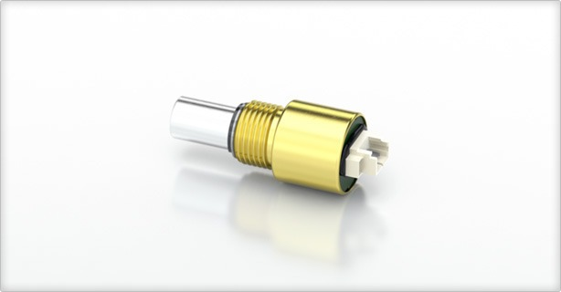

# Encoder readings to Robot Speed

Arduino code to extract robot speed from encoder readings.

Tested using MA3-A10-250-N Miniature Absolute Magnetic Shaft Encoder from US Digital (http://www.usdigital.com/products/ma3).




## Installation

The code relies on a external filtering library to filter the data from the encoder.  
To install the filter library, please go to https://github.com/JonHub/Filters, download the files and extract to your Arduino/library folder (more info: http://playground.arduino.cc/Code/Filters).

To include the filter library, please add to the top of your file:

```
#include <Filters.h>
```

Download this GitHub folder and extract it to the same Arduino/library folder. You should be ready to go, just add to the top of your file:

```
#include <Encoder.h>
```

## Usage / Example

To be written

## Contact Info

If you have any problem please contact Vinicius Goecks (vinicius.goecks@tamu.edu)
